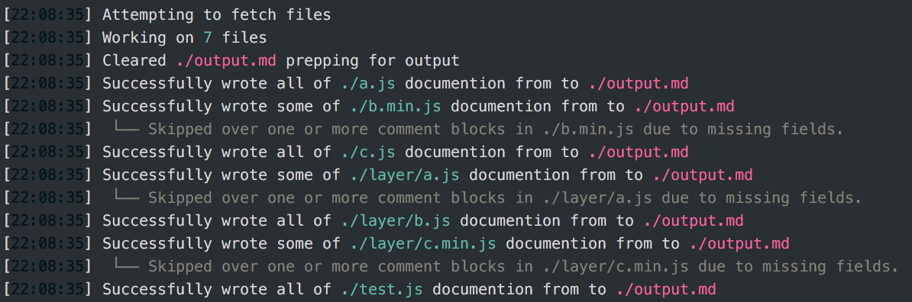

# Doxide

> A tool for transforming jsDoc style documentation in JavaScript files into API documentation in markdown.

## Getting Started

 - <a href="#installation">Installation</a>
 - <a href="#documentation">Documentation Syntax</a>
 - <a href="#usage">Usage</a>
  - <a href="#cli">CLI</a>
  - <a href="#doxyfile">doxyfile</a>
 - <a href="#examples">Examples</a>
 - <a href="#faq">FAQ</a>

## <a name="installation">Installation</a>

```
$ npm install --save-dev node-doxide -g
```

## <a name="documentation">Documentation Syntax</a>

### Functions

#### @constructors

You have the ability to explicitly define a function as a constructor -- this just slightly changes the result of the markdown that's generated to accurately reflect the fact that this function is a constructor. You can follow this tag with the function's description.

```
/**
 * @constructor
 * Defines the function being described as a constructor.
 */
const MyObjectConstructor = function () {
  // ...
}
```

#### @param

You must include the argument type within `{}` -- if the type can be anything, you can simply write `{*}` or `{any}`. You can follow the argument type with a description of the argument and the role it provides.

```
/**
 * @param {type} argName This is a description of this parameter.
 */
function (argName) {
  // ...
}
```

#### @return

You must include the return type within `{}` -- if there is no return type, simply write `{void}`. You can follow the return type with a description of what's being returned.

```
/**
 * @return {type} This is a description of what the function returns.
 */
function () {
  // ...
}
```

### Headers (BETA)

#### @header

...

```
/**
 * @header
 * HeaderName
 */
```

#### @property

...

```
/**
 * @property {type} propName This is a description of this property.
 */
```

## Sample Output

---

### <a href="#header" name="header">Header()</a>
**front** - *Node* -  The first element in the queue.<br />
**back** - *Node* -  The last element in the queue.<br />
**size** - *number* -  The number of nodes in the queue.<br />

 - **someFunc**(< _number_ >num, < _string_ >str) - *void* - Description of the return type of the function.

---

## <a name="usage">Usage</a>



There are a few different approaches for using Doxide for your application. You can either create a `doxyfile.json` to define a set of files to scan and where to write the output to, or you can manually define these arguments in the command line.

```
$ doxide --help

Usage: doxide <command>

  Possible <commands> could be:

  doxide                             Compiles based on your doxyfile.json
  doxide --h                         Prompts the help screen
  doxide --help                      Prompts the help screen
  doxide <file>                      Compiles <file>
  doxide <directory>                 Compiles all valid files in <directory>
  doxide <file1> -o <file2>          Compiles <file1> and stores output in <file2>
  doxide <directory> -o <file>       Compiles all valid files in <directory> and stores output in <file>
```


### <a name="cli">Using CLI arguments</a>

```
$ doxide path/to/file -o path/to/output
```

### <a name="doxyfile">Using doxyfile.json</a>

A `doxyfile.json` consists of a few main fields:

 - targets
 - output

The `targets` field consist of an array of files that are to be parsed by Doxide. Being an array, it can consist of a single file or multiple files. You can also include a path to a directory here, and it's important to note that the directory will include all subdirectories within.

The `output` field is a single string of the name of the file to write the output to. If no output destination is specified, the compiler will default to writing the output to the console.

Example of the `doxyfile.json` being used for [Needle](https://github.com/nickzuber/needle) which parses every source file and then stores the results into a single markdown file:

```json
{
  "targets" : [
    "./src"
  ],
  "output" : "./docs/doxide_output.md"
}

```

## <a name="example">Examples</a>

Using a `doxyfile.json`

```
$ cd root/director/with/doxyfile
$ doxide
```

Using the cli arguments

```
$ doxide main.js component.jsx router.js -o docs/output.md

[02:03:28] Attempting to fetch files
[02:03:28] Working on 3 files
[02:03:28] Cleared docs/output.md prepping for output
[02:03:28] Successfully wrote all of main.js documention from to output.md
[02:03:28] Successfully wrote all of component.jsx documention from to output.md
[02:03:28] Successfully wrote all of router.js documention from to output.md
[02:03:28] Finished after 15 ms
```

## <a name="faq">FAQ</a>

### Skipped over one or more comment blocks in .... due to missing fields.

While parsing through the documentation comments in a file, sometimes there hasn't been enough information provided for a particular block to be able to fill out the markdown function template. When this happens, we simply skip over that block and let you know that we've done so.

"Missing fields" could be something like a documentation block that wasn't given a function to document, but for things like a missing type definition in a `param` tag, we will throw an error.

### Unable to access the file ./.../.....md

If you try to set your output destination to a file within a directory that doesn't yet exist, we'll throw an error. Sending the output to a non existent file is fine, so long as we can _get_ there. The directory must first exist.

## License
[MIT](https://opensource.org/licenses/MIT)

Copyright (c) 2015-Present Nick Zuber
