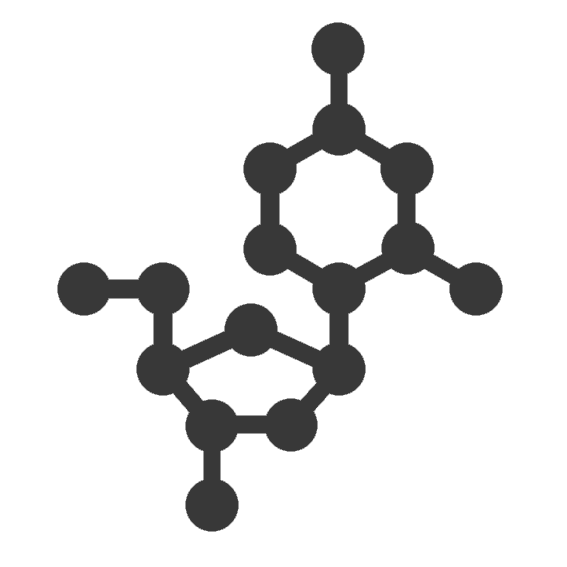

   
  
  
  
   
  
A compiler for converting documentation in JavaScript files to markdown.

## Installation 

## Usage

## API Reference

## Examples

## License
[MIT](https://opensource.org/licenses/MIT)

Copyright (c) 2015 Nick Zuber